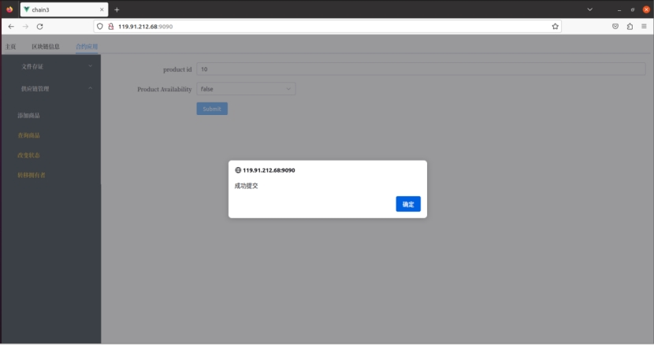
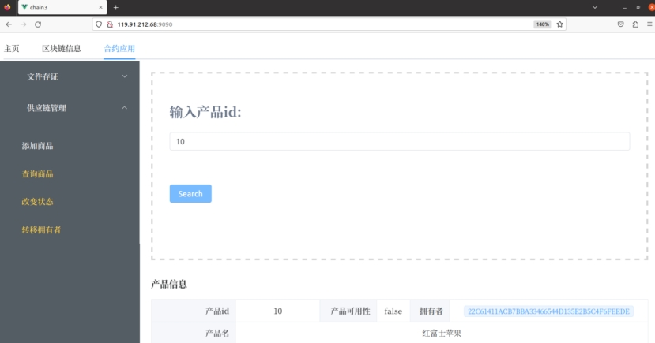
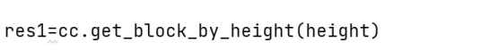

# Blockchain-Explorer-SupplyChain-FileProof

# 1 **区块链浏览器设计与实现**

## 1.1 **底层链选择——长安链**

### 1.1.1 **长安链技术优势**

自主可控：长安链核心模块全部自研，构建了完整的国密算法体系；拥有完善的权限管控机制和完备的隐私保护机制；支持安全的存储模式，兼容主流国产处理器及操作系统，构建自主可控技术底座。

开源开放：长安链践行开源开放理念，最大范围联合产学研用各类科研力量，由顶尖高校、知名企业等优势力量共同开发，同时广泛拥抱个人和企业开发者，共建充满活力的区块链技术生态。

性能领先：长安链自研高效合约引擎、高性能流水线共识算法MaxBFT及高速P2P网络Liquid，实现预写日志、异步落盘的高效存储方式，具备高并发、低延时的技术优势，交易吞吐能力可达10万TPS。

灵活装配：长安链将区块链执行流程标准化、模块化，推进区块链技术从手工作业模式演进到自动装配生产模式，方便用户根据不同的业务需求搭建区块链系统，为技术的规模化应用提供基础。

高效易用：多语言SDK工具及浏览器插件便捷接入，一键部署工具、可视化管理台以及多种建链工具实现低门槛上手，告警与监控体系实现高效运维，打造开发、调试、部署、运维全流程易用性。

功能丰富：支持3种身份权限体系、4种数据库、5种共识算法，适配不同使用场景，支持5种合约引擎及2种P2P网络，满足各类开发者需求；提供PB级存储引擎；可支持万级节点的大规模场景。

### 1.1.2 **长安链的****数据存储**

存储模块负责持久化存储链上的区块、交易、状态、历史读写集等账本数据，并对外提供上述数据的查询功能。区块链以区块为单位进行批量的数据提交，一次区块提交会涉及到多项账本数据的提交，比如：交易提交，状态数据修改等，所以存储模块需要维护账本数据的原子性。长安链支持常用的数据库来存储账本数据，如LevelDB、BadgerDB、TikvDB、MySQL等数据库，业务可选择其中任意一种数据库来部署区块链。

图 1存储模块运行逻辑

### 1.1.3 **长安链的智能合约SDK**

用户通过高级语言编写的智能合约一般情况而言，都需要存取区块链上的数据、API支持，ChainMaker为不同的高级语言提供了不同的SDK。当然，这些SDK提供的基本能力是相同的，包括读取数据、写入数据、查询区块链的一些状态等。

不同语言的SDK受限于语言本身特性和编译器的支撑能力，比如go语言支持函数同时返回多个数据，而tinygo编译器对垃圾回收支持存在缺陷，加上区块链系统本身为智能合约提供的运行内存大小受限、调用栈深度受限，用户编写合约时，需要注意这些特性。

目前ChainMaker已经支持的智能合约开发SDK包括Python、Java、Golang、Rust、Solidity、TinyGo和C++。

图 2使用SDK创建智能合约流程

 

 

## 1.2 **供应链管理模块**

### 1.2.1 **产品添加**

#### 1.2.1.1 **流程概述**

\1. 用户在前端界面输入产品名称并提交。

\2. API服务层接收请求并调用相应的智能合约方法。

\3. 智能合约生成产品ID，并将产品名称、ID、可用性（默认为true）和初始拥有者信息写入区块链。

\4. 将生成的产品ID返回给API服务层。

\5. API服务层将产品ID返回给前端界面，通知用户产品已成功添加。

#### 1.2.1.2 **前端页面**

 

 

#### 1.2.1.3 **API接口设计**

 

#### 1.2.1.4 **合约核心代码**

 

### 1.2.2 **产品查询**

#### 1.2.2.1 **流程概述**

\1. 用户在前端界面输入产品ID并提交。

\2. API服务层接收请求并调用相应的智能合约方法。

\3. 智能合约查询区块链中的产品信息。

\4. 将查询结果返回给API服务层。

\5. API服务层将查询结果返回给前端界面，展示给用户。

#### 1.2.2.2 **前端页面**

商品1：

 

商品2：

 

商品3：

 

#### 1.2.2.3 **API接口设计**

 

#### 1.2.2.4 **合约核心代码**

 

### 1.2.3 **产品状态更新**

#### 1.2.3.1 **流程概述**

\1. 用户在前端界面输入产品ID和新的状态（true或false）并提交。

\2. API服务层接收请求并调用相应的智能合约方法。

\3. 智能合约更新区块链上的产品可用性。

\4. 将更新结果返回给API服务层。

\5. API服务层将更新结果返回给前端界面，通知用户产品状态已成功更新。

#### 1.2.3.2 **前端页面**

输入商品id和修改的状态即可修改商品可用性

 

重新查询商品发现商品可用性已被修改

原来的商品可用性：

 

修改后的商品可用性：

 

#### 1.2.3.3 **API接口设计**

 

#### 1.2.3.4 **合约核心代码**

 

### 1.2.4 **产品所有权转移**

#### 1.2.4.1 **流程概述**

\1. 用户在前端界面输入产品ID和新拥有者信息并提交。

\2. API服务层接收请求并调用相应的智能合约方法。

\3. 智能合约更新区块链上的产品拥有者信息。

\4. 将更新结果返回给API服务层。

\5. API服务层将更新结果返回给前端界面，通知用户所有权已成功转移。

#### 1.2.4.2 **前端页面**

 

（1）原来的

 

（2）修改后的

 

 

#### 1.2.4.3 **API接口设计**

 

#### 1.2.4.4 **合约核心代码**

 

### 1.2.5 **根据交易ID查询块高**

 

 

展示的数据包括：

区块高度、合约名字、组织id、合约方法、时间戳

### 1.2.6 **根据块高查询区块信息**

 

 

 

 

展示的数据包括：

区块高度、链id、区块版本、交易数、区块时间戳

### 1.2.7 **根据交易ID查询区块信息**

 

 

 

展示的数据包括：

区块高度、链id、区块版本、交易数、区块时间戳

## 1.3 **文件存证模块**

### 1.3.1 **文件信息上传**	

#### 1.3.1.1 **流程概述**

\1. 用户在前端界面输入文件名、哈希值和时间并提交。

\2. API服务层接收请求并调用相应的智能合约方法。

\3. 智能合约将文件信息写入区块链。

\4. 将上传结果返回给API服务层。

\5. API服务层将上传结果返回给前端界面，通知用户文件信息已成功上传。

#### 1.3.1.2 **前端页面**

上传文件信息：输入参数File name、Hash value（要求23位）、time

上传成功会有弹窗，弹窗内容为：“随便文件名cb8e1e07a593554dfb6cdc52023年6月12日15:04:18”

 

上传hash不是23位，弹窗警告：“请输入23个字符的hash值”

 

#### 1.3.1.3 **API接口设计**

 

#### 1.3.1.4 **合约核心代码**

 

### 1.3.2 **文件哈希值搜索与验证**

#### 1.3.2.1 **流程概述**

\1. 用户在前端界面输入文件哈希值并提交。

\2. API服务层接收请求并调用相应的智能合约方法。

\3. 智能合约查询区块链中的文件信息。

\4. 将查询结果返回给API服务层。

\5. API服务层将查询结果返回给前端界面，展示给用户。

#### 1.3.2.2 **前端页面**

输入搜索文件hash值

获取文件信息：file name、file hash、time、gas used、tx id

 

 

#### 1.3.2.3 **API接口设计**

 

#### 1.3.2.4 **合约核心代码**

 

## 1.4 **前端信息展示页面**

### 1.4.1 **节点信息与区块链高度展示**

#### 1.4.1.1 **流程概述**

\1. 前端界面定期向API服务层请求节点信息和区块链高度。

\2. API服务层查询相关信息并返回给前端界面。

\3. 前端界面将查询结果展示给用户。

#### 1.4.1.2 **前端页面**

每应用一次合约，区块链高度即会增加

（1）原来的

 

（2）后来的

 

 

 

***\*主页显示\****

 

 

 

#### 1.4.1.3 **API接口设计**

